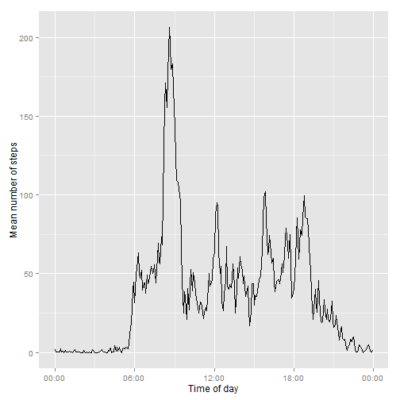
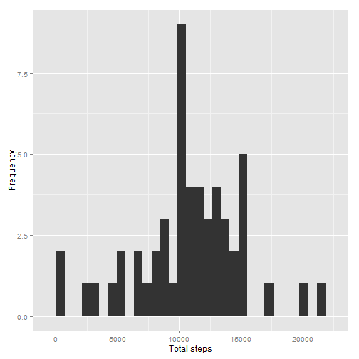
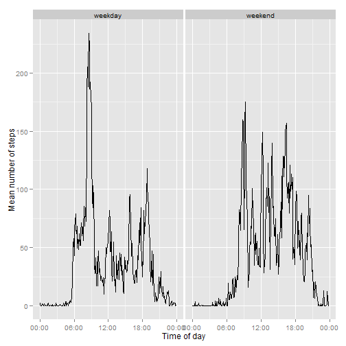

# Reproducible Research: Peer Assessment 1


## Loading and preprocessing the data


Reads all information in CSV file.

```r
allData <- read.csv('activity.csv')
```

Column 'rawDate' combines interval and date columns.

```r
time <- formatC(allData$interval / 100, 2, format='f')
allData$rawDate <- as.POSIXct(paste(allData$date, time),format='%Y-%m-%d %H.%M', tz='GMT')
```

Helper column 'timestamp' created to have a reference point regarding current datetime.

```r
allData$timestamp <- format(allData$rawDate, format='%H:%M:%S')
allData$timestamp <- as.POSIXct(allData$timestamp, format='%H:%M:%S')
```

## What is mean total number of steps taken per day?

First, calculate the mean number of steps for each day:

```r
total.steps <- tapply(allData$steps, allData$date, sum, na.rm=TRUE)
```

Let's look at the mean and median for the total steps per day:

```r
mean(total.steps)
```

```
## [1] 9354
```

```r
median(total.steps)
```

```
## [1] 10395
```

And let's take a look at the distribution of total number of steps per day with a histogram:

```r
library(ggplot2)
qplot(total.steps, xlab='Total steps', ylab='Frequency')
```

```
## stat_bin: binwidth defaulted to range/30. Use 'binwidth = x' to adjust this.
```

 


## What is the average daily activity pattern?

Calculates mean each 5 minute interval, and then put it in a data frame.

```r
mean.steps <- tapply(allData$steps, allData$timestamp, mean, na.rm=TRUE)
daily.pattern <- data.frame(time=as.POSIXct(names(mean.steps)),
                            mean.steps=mean.steps)
```

Plot for the means.

```r
library(scales)
ggplot(daily.pattern, aes(time, mean.steps)) +
    geom_line() +
    xlab('Time of day') +
    ylab('Mean number of steps') +
    scale_x_datetime(labels=date_format(format='%H:%M'))
```

 

Displays which 5 mins interval has the highest mean value

```r
most <- which.max(daily.pattern$mean.steps)
format(daily.pattern[most,'time'], format='%H:%M')
```

```
## [1] "08:35"
```


## Imputing missing values
The number of intervals with "NA":

```r
summary(allData$steps)
```

```
##    Min. 1st Qu.  Median    Mean 3rd Qu.    Max.    NA's 
##     0.0     0.0     0.0    37.4    12.0   806.0    2304
```

Uses mean values to fill NAs steps for a 5 mins interval for the entire dataset.

```r
library(Hmisc)
```

```
## Error: there is no package called 'Hmisc'
```

```r
allData.imputed <- allData
allData.imputed$steps <- with(allData.imputed, impute(steps, mean))
```

```
## Error: could not find function "impute"
```

Compares the daily means and medians with the original data set and the filtered data set.

```r
total.steps.imputed <- tapply(allData.imputed$steps,
                              allData.imputed$date, sum)
mean(total.steps)
```

```
## [1] 9354
```

```r
mean(total.steps.imputed)
```

```
## [1] NA
```

```r
median(total.steps)
```

```
## [1] 10395
```

```r
median(total.steps.imputed)
```

```
## <NA> 
##   NA
```

Histogram of the filtered dataset.

```r
qplot(total.steps.imputed, xlab='Total steps', ylab='Frequency')
```

```
## stat_bin: binwidth defaulted to range/30. Use 'binwidth = x' to adjust this.
```

 

Filtering the missing data has increased the average number of samples.

## Are there differences in activity patterns between weekdays and weekends?

New factor column to distinguish weekday or weekend.

```r
day.type <- function(date) {
    if (weekdays(date) %in% c('Saturday', 'Sunday')) {
        return('weekend')
    } else {
        return('weekday')
    }
}

day.types <- sapply(allData.imputed$rawDate, day.type)
allData.imputed$day.type <- as.factor(day.types)
```

Dataframe to store the means for weekdays and weekends.

```r
mean.steps <- tapply(allData.imputed$steps,
                     interaction(allData.imputed$time,
                                 allData.imputed$day.type),
                     mean, na.rm=TRUE)
```

```
## Warning: Name partially matched in data frame
```

```r
day.type.pattern <- data.frame(time=as.POSIXct(names(mean.steps)),
                               mean.steps=mean.steps,
                               day.type=as.factor(c(rep('weekday', 288),
                                                   rep('weekend', 288))))
```

Compares the patterns between weekdays and weekends.

```r
ggplot(day.type.pattern, aes(time, mean.steps)) +
    geom_line() +
    xlab('Time of day') +
    ylab('Mean number of steps') +
    scale_x_datetime(labels=date_format(format='%H:%M')) +
    facet_grid(. ~ day.type)
```

 
